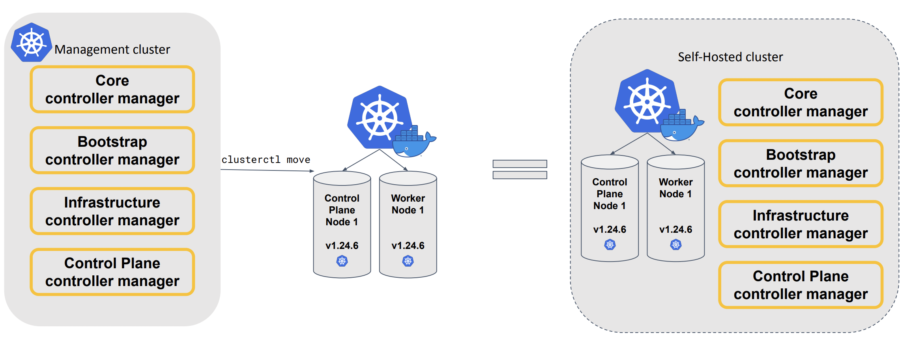

# Creating a Self-Hosted Cluster

A self-hosted cluster is a cluster that acts as both the management cluster and the workload cluster. A self-hosted cluster manages its own lifecycle.

In this section we will create a workload cluster and make it self-hosted by converting it into its own management cluster.



<!-- table of contents generated via: https://github.com/thlorenz/doctoc -->
<!-- START doctoc generated TOC please keep comment here to allow auto update -->
<!-- DON'T EDIT THIS SECTION, INSTEAD RE-RUN doctoc TO UPDATE -->
**Table of Contents**

- [Create a Cluster](#create-a-cluster)
- [Convert Workload Cluster to Management Cluster](#convert-workload-cluster-to-management-cluster)
- [Clean up](#clean-up)
- [Next: Deleting clusters and cleaning up](#next-deleting-clusters-and-cleaning-up)
- [More information](#more-information)

<!-- END doctoc generated TOC please keep comment here to allow auto update -->

## Create a Cluster

First, lets create a workload cluster called `docker-cluster-self-hosted`. These steps will be similar to how we created `docker-cluster-one`.

Create the cluster:

```bash
kubectl apply -f yamls/clusters/7-docker-cluster-self-hosted.yaml
```

Retrieve the cluster's kubeconfig: (you might have to retry the command after the cluster is provisioned)

```bash
kind get kubeconfig --name docker-cluster-self-hosted > self-hosted.kubeconfig
```

Install Calico on the Cluster using our prepared yaml spec:

```bash
kubectl --kubeconfig self-hosted.kubeconfig apply -f yamls/cni/calico.yaml
```

Let's wait until all nodes are ready:

```bash
kubectl --kubeconfig self-hosted.kubeconfig get nodes -w
```

## Convert Workload Cluster to Management Cluster

Now that we have the `docker-cluster-self-hosted` workload cluster lets install Cluster API components on it to make it a management cluster.

For Windows users:
```bash
$env:CLUSTERCTL_REPOSITORY_PATH = ([System.Uri](Get-Item .).FullName).AbsoluteUri + "/clusterctl/repository"
$env:CLUSTER_TOPOLOGY = 'true'
$env:EXP_RUNTIME_SDK = 'true'
clusterctl init --kubeconfig self-hosted.kubeconfig --infrastructure docker --config ./clusterctl/repository/config.yaml
```
For macOS and Linux users:
```bash
export CLUSTERCTL_REPOSITORY_PATH=$(pwd)/clusterctl/repository
export CLUSTER_TOPOLOGY=true
export EXP_RUNTIME_SDK=true
clusterctl init --kubeconfig self-hosted.kubeconfig --infrastructure docker --config ./clusterctl/repository/config.yaml
```

Make sure that the Cluster API components are installed successfully by running:

```bash
kubectl --kubeconfig self-hosted.kubeconfig get deployments -A
```

The output should look like:

```bash
NAMESPACE                           NAME                                            READY   UP-TO-DATE   AVAILABLE   AGE
capd-system                         capd-controller-manager                         1/1     1            1           22m
capi-kubeadm-bootstrap-system       capi-kubeadm-bootstrap-controller-manager       1/1     1            1           22m
capi-kubeadm-control-plane-system   capi-kubeadm-control-plane-controller-manager   1/1     1            1           22m
capi-system                         capi-controller-manager                         1/1     1            1           22m
cert-manager                        cert-manager                                    1/1     1            1           23m
cert-manager                        cert-manager-cainjector                         1/1     1            1           23m
cert-manager                        cert-manager-webhook                            1/1     1            1           23m
kube-system                         calico-kube-controllers                         1/1     1            1           23m
kube-system                         coredns                                         2/2     2            2           24m
```

Now lets move the Cluster API resources to the self-hosted cluster

```bash
clusterctl move --to-kubeconfig self-hosted.kubeconfig
```

The output should look like:

```bash
Performing move...
Discovering Cluster API objects
Moving Cluster API objects Clusters=2
Moving Cluster API objects ClusterClasses=1
Creating objects in the target cluster
Deleting objects from the source cluster
```

We have successfully made `docker-cluster-self-hosted` a self-hosted cluster. Lets take a look at how the self-hosted cluster looks.

```bash
kubectl --kubeconfig self-hosted.kubeconfig get clusters
```

The output resembles:

```bash
NAME                         PHASE         AGE   VERSION
docker-cluster-self-hosted   Provisioned   3m    v1.24.6
```

Notice that the `docker-cluster-self-hosted` is listed among the clusters that it is managing. We got a self-hosted cluster!

Try scaling the MachineDeployments on the self-hosted cluster to observe how simple it is to manage a self-hosted cluster.

Do you remember how to scale the MachineDeployments? (Hint: look at [scale operation](./3-cluster-topology.md#more-scale-operations)).

## Clean up

Before moving to the next sections of the tutorial lets convert `kubecon-na-22-capi-lab` back into our management cluster.

```bash
kind get kubeconfig --name kubecon-na-22-capi-lab > kubecon-na-22-capi-lab.kubeconfig
```

```bash
clusterctl move --kubeconfig self-hosted.kubeconfig --to-kubeconfig kubecon-na-22-capi-lab.kubeconfig
```

After successfully moving back lets delete the `docker-cluster-self-hosted` cluster:

```bash
kubectl delete cluster docker-cluster-self-hosted
```


## Next: Deleting clusters and cleaning up

[Next - find out how to clean up this tutorial](8-deleting-clusters-and-cleaning-up.md#cleaning-up-resources-created-by-this-tutorial)

## More information
- To learn more about self-hosting a management cluster see the [`clusterctl pivot` section in the CAPI book.](https://cluster-api.sigs.k8s.io/clusterctl/commands/move.html#pivot)